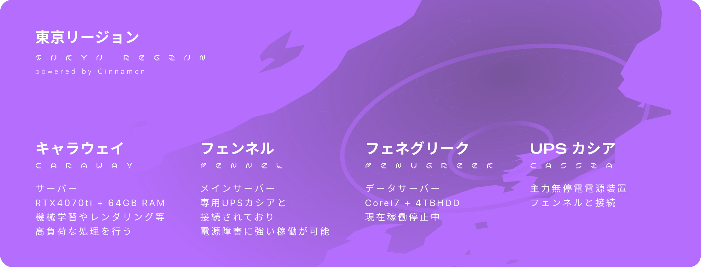

<!--

Hi! Thanks for coming by to look at the markdown files! (Easter egg-ish message)

⠀⠀ ⠀ . °
⠀ ⠀＿❤︎
⊂⊂ ・）
⠀/　 |
⊂＿__u

-->

  

## Hi there

限界高校生香辛料です。 
フロントエンドが大好きです。 
リポジトリは基本的に非公開です。  
動画とかを作る仕事をしています。

 

## Organization
- CinnamonWorks - Operator 
運営+開発+デザイン / Product DevOps and Design
- Shahu.ski - Staff 
Shahu.ski (Misskey) 運営 / Misskey Instance Operation

## Links
- Portfolio - [cinnamon.works](https://cinnamon.works)
- Twitter - [@CSea2073](https://twitter.com/CSea2073)
- Youtube - [@CinnamonSea2073](https://www.youtube.com/channel/UCzycLra81_AZJVOrGDIFcfQ)
- Qiita - [@CinnamonSea2073](https://qiita.com/CinnamonSea2073)
- Shahu.ski (Misskey) - [@cinnamon73](https://shahu.ski/@cinnamon73)

## Contact
- Twitter DM - [@CSea2073](https://twitter.com/CSea2073)
- Discord DM - @cinnamonsea2073
- Mail - CinnamonSea2073@tutanota.com  
This Mail address is used only first contact

## History
### 2022
- 原神ステータスBot リリース

### 2023
- GPA2023「Memevo」一次選考通過
- XembedBot リリース
- MV「DISTOPIA」 映像制作
- ポートフォリオサイト 制作
- Cover「D.I.Y」 映像制作

### 2024
- 某写真展 入選 
地理的&情報的な理由により、詳細は非公開。
- 校内プロジェクト「せせ塾」 デザイン, プログラム全般担当
- 未踏ジュニア2024「Yumecord」 企画書提出
- PV「shahu.ski 1st Anniversary」 映像制作

<!-- ライトモート：theme=light, ダークモート：theme=dark -->
<!-- アイコンの選択肢一覧：https://arc.net/l/quote/zizyykfh -->
## Skills

### Arts

### Language / Framework / Database / Engine
 
 
 
 

### Others
 
 

### Beginner
 

### interest
 

## Servers

### 東京 / Tokyo Region

Powered by [@CinnamonSea2073](https://github.com/CinnamonSea2073)
  

Sponsor by 
- nikawamikan
- chan-mai
- masatukeisu
- R(anonymous)
- bsps
- reo
- S(anonymous)
- oseyuki_jp
- K(anonymous)

### 石狩 / Ishikari Region

Powered by [@nikawamikan](https://github.com/nikawamikan)

## Qiita

以下のリストは定期的に自動更新されます！

<!-- BLOG-POST-LIST:START -->
- [GPT-4しか知らないあなたの知識はもう古いらしい](https://qiita.com/CinnamonSea2073/items/892f2e46d97c30ccaa5b)
- [【Python】プロパティの便利な使い方5選](https://qiita.com/CinnamonSea2073/items/f14fe8f39e8c9fe13519)
- [コレを読めば理解できる！const、let、varの違い](https://qiita.com/CinnamonSea2073/items/1ffe792b025d878cbda6)
- [ユーザーかOrganizationが記事が投稿したらDiscordに通知する](https://qiita.com/CinnamonSea2073/items/68abbce0c377a19beedb)
<!-- BLOG-POST-LIST:END -->